# 🎮 Awesome Action-Adventure Video Games

  
  
  
  

  

---

## 💡 Overview & SEO Highlights

Welcome to the ultimate curated directory of **Action-Adventure Video Games** and **Open-Source Game Engines**! Whether you are a gamer seeking top-rated commercial blockbusters, a modder exploring customizable sandboxes, or a game developer looking for production-ready open-source engines like OpenMW and Minetest, this list provides comprehensive insights into pricing, free tiers, publisher size, and GitHub community stars.

> **Key Focus Areas**: Exploration 🧭 | Visceral Combat 🗡️ | Puzzle-Solving 🧩 | Narrative-Driven Quests 📖 | Voxel Sandboxes 🧊 | Game Engine Recreations ⚙️

---

## 📋 Table of Contents

- [📊 Commercial Games & SaaS Market](#-commercial-games--saas-market)
- [🔓 Open-Source Projects & Game Engines](#-open-source-projects--game-engines)
- [🤝 How to Contribute](#-how-to-contribute)
- [💖 Support & Sponsorship](#-support--sponsorship)
- [⚠️ Disclaimer](#%EF%B8%8F-disclaimer)
- [📈 Star History](#-star-history)

---

## 📊 Commercial Games & SaaS Market

> 📈 **Market Size & Structure**: The global action-adventure video game market is valued at **~$70 Billion** (part of the overall $200B+ gaming industry). The sector is **moderately concentrated** among major AAA publisher conglomerates (Sony, Take-Two, Microsoft, Ubisoft, Nintendo), while remaining vibrant with independent studio hits.

### 💰 Commercial & Subscription Gaming Products

| Product Name / Game | Starting Pricing | Free Tier / Trial Limit | Publisher / Parent Company | Est. Market Cap / Valuation / Revenue |
| :--- | :--- | :--- | :--- | :--- |
| **[Grand Theft Auto V](https://www.rockstargames.com/gta-v)** | $29.99 one-time | 7-Day Free Trial via PlayStation Plus Extra / Xbox Game Pass Ultimate | Take-Two Interactive | ~$30 Billion Market Cap |
| **[Red Dead Redemption 2](https://www.rockstargames.com/reddeadredemption2/)** | $59.99 one-time | 14-Day Free Trial via service promotions | Take-Two Interactive | ~$30 Billion Market Cap |
| **[Sea of Thieves](https://www.seaofthieves.com/)** | $39.99 one-time / $9.99/mo Game Pass | 14-Day Free Trial via Xbox Game Pass Ultimate ($1 promo) | Microsoft (Xbox Game Studios) | ~$3.1 Trillion Market Cap |
| **[Star Wars Jedi: Survivor](https://www.ea.com/games/star-wars/jedi-survivor)** | $69.99 one-time / $14.99/mo EA Play Pro | 10-Hour Free Trial via EA Play standard tier | Electronic Arts (EA) | ~$38 Billion Market Cap |
| **[God of War Ragnarok](https://www.playstation.com/en-us/games/god-of-war-ragnarok/)** | $59.99 one-time | 3-Hour Free Trial via PlayStation Plus Premium | Sony Interactive Entertainment | ~$115 Billion Market Cap |
| **[Horizon Forbidden West](https://www.playstation.com/en-us/games/horizon-forbidden-west/)** | $49.99 one-time | 5-Hour Free Trial via PlayStation Plus Premium | Sony Interactive Entertainment | ~$115 Billion Market Cap |
| **[The Legend of Zelda: Tears of the Kingdom](https://www.zelda.com/tears-of-the-kingdom/)** | $69.99 one-time | 0-Day Trial (Demo available in select retail kiosks) | Nintendo | ~$65 Billion Market Cap |
| **[Monster Hunter: World](https://www.monsterhunter.com/world/)** | $29.99 one-time | Free Trial Demo (Up to HR 4 / early story quests) | Capcom | ~$11 Billion Market Cap |
| **[Assassin's Creed Valhalla](https://www.ubisoft.com/en-us/game/assassins-creed/valhalla)** | $59.99 one-time / $17.99/mo Ubisoft+ | 7-Day Free Trial via Ubisoft+ Premium | Ubisoft | ~$2.5 Billion Valuation |
| **[Tomb Raider Definitive Edition](https://www.tombraider.com/)** | $19.99 one-time | Free Tomb Raider I-III Remastered Demo on Steam | Embracer Group / Crystal Dynamics | ~$2.0 Billion Valuation |

---

## 🔓 Open-Source Projects & Game Engines

Below is a curated selection of open-source action-adventure projects, game engine recreations, and voxel sandboxes, ranked by GitHub Star count.

| Star Count Badge | Project Name | License | Description & Category |
| :---: | :--- | :--- | :--- |
|  | **[Godot Engine](https://github.com/godotengine/godot)** | MIT | 🚀 **Premier Open-Source 2D/3D Game Engine**. Fully featured engine tailored for action-adventure game creation with GDScript, C#, and C++. |
|  | **[Minetest (Luanti)](https://github.com/minetest/minetest)** | LGPL-2.1 | 🧊 **Voxel Sandbox & Engine**. Extensible voxel adventure engine powered by Lua scripts with infinite world generation and modding support. |
|  | **[DevilutionX](https://github.com/diasurgical/devilutionX)** | Unlicense | 🗡️ **Diablo I Engine Recreation**. Cross-platform source port of Diablo and Hellfire with modern UI, gamepad support, and multiplayer. |
|  | **[OpenMW](https://github.com/OpenMW/openmw)** | GPL-3.0 | 📜 **Morrowind RPG Engine Reimplementation**. Modern C++ reimplementation of TES III: Morrowind engine supporting Linux, macOS, Windows, and Android. |
|  | **[Bevy Engine](https://github.com/bevyengine/bevy)** | MIT / Apache-2.0 | 🦀 **Data-Driven Rust Game Engine**. Refreshingly simple data-driven game engine built in Rust for high-performance 2D/3D action games. |
|  | **[Veloren](https://github.com/veloren/veloren)** | GPL-3.0 | 🏹 **Multiplayer Voxel Action RPG**. Open-world voxel RPG written in Rust, featuring combat, crafting, dungeon raids, and gliding. |
|  | **[Xonotic](https://github.com/xonotic/xonotic)** | GPL-3.0 | 🔫 **Arena FPS & Fast Combat**. Addictive arena shooter with slick movement mechanics, diverse weaponry, and active competitive play. |
|  | **[OpenLara](https://github.com/XProger/OpenLara)** | BSD-2-Clause | 🏺 **Classic Tomb Raider Engine (C++)**. Runs Tomb Raider 1–5 in modern browsers (WebGL), mobile devices, and consoles. |
|  | **[FLARE Engine](https://github.com/clintbellanger/flare-engine)** | GPL-3.0 | 🛡️ **Free Libre Action Roleplaying Engine**. Isometric 2D action RPG engine built specifically for single-player hack-and-slash adventures. |
|  | **[OpenTomb](https://github.com/opentomb/OpenTomb)** | LGPL-3.0 | 🏛️ **Open Tomb Raider Engine**. Cross-platform engine designed to play classic Tomb Raider 1–5 levels with lua scripting and improved physics. |
|  | **[Sauerbraten (Cube 2)](https://github.com/sauerbraten/sauerbraten)** | zlib | 🧱 **3D FPS Engine with In-Game Editing**. Fast-paced arena FPS featuring cooperative real-time map editing in 3D. |
|  | **[Red Eclipse](https://github.com/redeclipse/base)** | zlib | 🏃 **Parkour Arena Shooter**. Arena action featuring parkour mechanics, wall-running, sliding, and extensive customisation. |
|  | **[The Mana World](https://github.com/themanaworld/tmwa-server-data)** | GPL-2.0 | 🧙 **2D Retro MMORPG**. Community-driven 2D open-source MMORPG with classic action-adventure questing. |

---

## 🤝 How to Contribute

Contributions are welcome! Follow these steps to submit your favorite action-adventure game or open-source project:

1. 🍴 **Fork** the repository.
2. 📝 **Add/edit** entries in `README.md` using clean Markdown formatting.
3. 🔗 Include official link, 1–2 sentence description, license details, and pricing/star information.
4. 🚀 Submit a **Pull Request** with a brief summary of additions.

Please review our repository guidelines at [Awesome-Awesome-Awesome](https://github.com/ishandutta2007/Awesome-Awesome-Awesome).

---

## 💖 Support & Sponsorship

If you found this curated list helpful, please consider supporting the project! Your encouragement keeps this directory updated and maintained.

- ⭐ **Star** this repository to show your appreciation!
- 🔀 **Fork** and share with fellow gamers and open-source developers.
- ☕ **Buy me a coffee / Sponsor**: Support ongoing maintenance via the [GitHub Sponsor Dashboard](https://github.com/sponsors/ishandutta2007).

---

## ⚠️ Disclaimer

- This is a **community-curated** open catalog intended for research and educational purposes.
- Commercial games listed are proprietary titles requiring purchase from official storefronts.
- Open-source engine recreations (e.g., OpenMW, OpenLara, DevilutionX) require legally acquired original game data files to play.

---

## 📈 Star History

